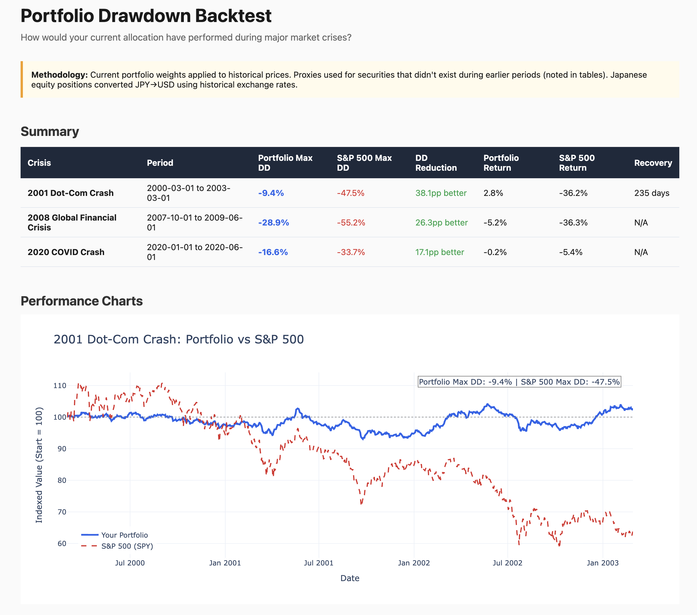

# Disclaimer

This tool is for informational and educational purposes only. It is not investment advice, and should not be used as the basis for any financial decisions. Past performance — real or simulated — does not guarantee future results. Consult a qualified financial advisor before making changes to your portfolio.



# Drawdown Backtest

Backtests your current portfolio against major market crises — the dot-com bubble (2000–2003), the 2008 Global Financial Crisis (2007–2009), and the COVID crash (2020) — to see how it would have performed during each downturn.

## Usage

```
/drawdown-backtest
/drawdown-backtest --periods gfc,covid
```

| Argument | Default | Description |
|----------|---------|-------------|
| `--periods LIST` | `dotcom,gfc,covid` | Comma-separated crisis periods to test |
| `--skip-dashboard` | false | Skip HTML dashboard generation and browser open |

## Prerequisites

- **Hiro MCP server** connected to Claude with linked brokerage/investment accounts
- **Python 3** with dependencies: `pip3 install yfinance pandas numpy plotly pytest`

## What It Produces

Each run creates a timestamped folder — previous runs are never overwritten:

```
drawdown-backtest-YYYY-MM-DD-HHMM/
├── drawdown-backtest-YYYY-MM-DD-HHMM-dashboard.html
├── drawdown-backtest-YYYY-MM-DD-HHMM-summary.md
├── portfolio.json
└── drawdown-backtest-YYYY-MM-DD-HHMM-data.json
```

- **summary.md** — Markdown analysis with a drawdown comparison table (portfolio vs. S&P 500 for each crisis), key insights per period highlighting best and worst performers, and a portfolio resilience assessment.
- **dashboard.html** — Interactive Plotly dashboard with drawdown curves over time, per-security performance tables with sortable columns, and asset class breakdown charts.
- **portfolio.json** — Snapshot of your portfolio as fetched from Hiro. Saved for reproducibility so you can see exactly what positions were tested.
- **data.json** — Raw backtest results for downstream use or diffing between runs.

## How to Read the Results

**Max Drawdown** — The largest peak-to-trough decline during a crisis period, expressed as a percentage. A max drawdown of -35% means the portfolio lost 35% from its highest point before recovering. Lower (less negative) is better.

**Portfolio vs. S&P 500** — The summary table compares your portfolio's max drawdown and total return against the S&P 500 for each crisis. A portfolio that drops less than the S&P 500 during crashes has better downside protection — this is the "drawdown reduction" column.

**Proxy Annotations** — Many securities didn't exist during earlier crises (e.g., a bond ETF launched in 2010 can't have real 2008 data). The backtest uses proxies — similar securities or indices that did exist — to approximate historical behavior. Proxy annotations in the dashboard tables show where this substitution happened.

**Key Methodology Caveats:**
- **Buy-and-hold** — The backtest assumes no rebalancing during each crisis. Your actual behavior (panic selling, rebalancing, adding cash) would produce different results.
- **Point-in-time weights** — Your current portfolio weights are applied retroactively to historical data. If your allocation was different during a past crisis, actual results would have differed.
- **No leverage** — Margin and leverage positions are excluded. If you use leverage, actual drawdowns would be worse.
- **Simulated series** — Some asset classes without historical data use simulated returns with fixed seeds. These are uncorrelated by construction and may understate portfolio drawdown.

## How It Works

The skill runs 6 phases automatically: (1) fetch your full portfolio from Hiro, calculating each position's weight, (2) auto-classify each holding into an asset class (US equity, bonds, gold, crypto, etc.), (3) build proxy mappings so every position has historical data for each crisis period, (4) run the Python backtest script which downloads historical prices via yfinance and calculates drawdown curves, (5) write the markdown summary with comparison tables and insights, and (6) open the interactive dashboard in your browser.
